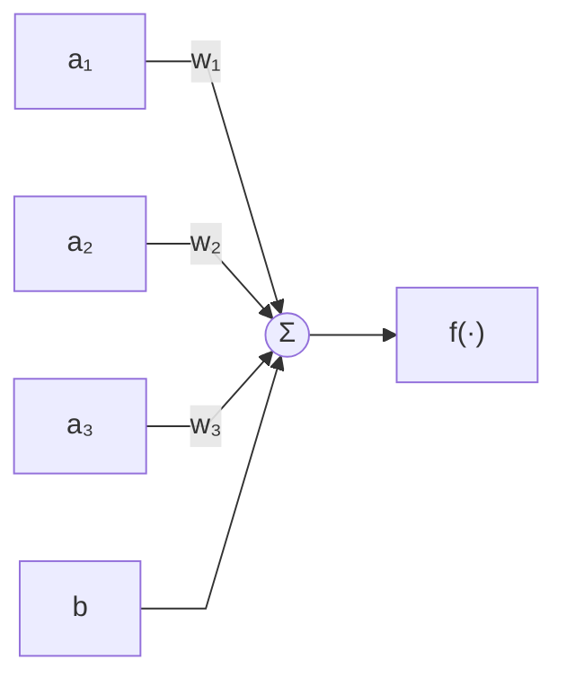
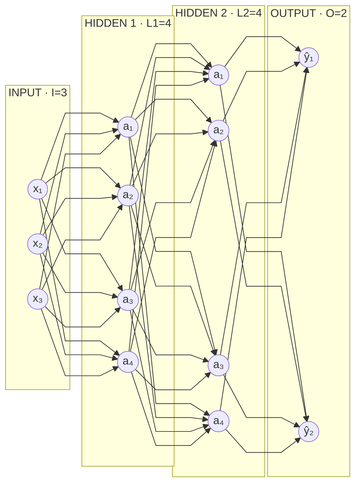

# Appunti: MLP, backpropagation, gradient descent

## L'MLP

Un MLP si descrive come `MLP(I, [L1, L2, ..., O])`, dove:

- `I` = numero di input
- `L1..Ln` = numero di neuroni per layer
- `O` = numero di output

### Un neurone

Ogni neurone prende le attivazioni del layer precedente, le pesa, ci somma un
bias, e passa il risultato in una funzione di attivazione. Qui un neurone con
tre input:



I `wᵢ` e il `b` sono i parametri del neurone: quelli che il training cambia.
Gli `aᵢ` in ingresso arrivano da fuori.

`f()` e' la funzione di attivazione, ad esempio `tanh` / `relu` / `sigmoid`.

### La rete

I neuroni si mettono in layer, e ogni layer e' collegato completamente al
precedente. Un `MLP(3, [4, 4, 2])`:



## Un MLP e' una grande espressione

Fondamentalmente un MLP e' un'enorme espressione con:

- **input**
- **parametri** (i `w` e i `b`)

che tira fuori un certo numero di **output**.

## Training

I dati:

- `inputs` = matrice `N x I`
- `outputs` = matrice `N x O`

dove `N` = numero di esempi.

### Loss

Il loss e' una misura dell'errore della predizione che fa la rete rispetto
all'effettivo output. E' fondamentale per capire se cambiare i parametri
migliora o peggiora il risultato:

```
# forward pass, calcolo il vettore di output
per ogni esempio:
  y[nth_esempio] = mlp(inputs[nth_esempio])

# calcolo del loss
loss = 0
per ogni esempio:
  loss += (expected_output[nth_esempio] - y[nth_esempio])^2
```

Ci sono tante formule diverse per il loss: mean squared (Pitagora),
max-margin...

### La struttura dati

Ma come fare a capire COME modificare i parametri?

Immaginiamo di NON usare scalari semplici, ma strutture dati particolari, che
wrappano lo scalare e si portano dietro anche informazioni aggiuntive. Queste
strutture reagiscono a tutti gli operatori numerici in maniera trasparente,
quindi non ce ne accorgiamo nemmeno:

```
# scalare
x1 = 2.0

# wrapper
x1 = Value(2.0, label="x1")
x1.data    # => 2.0

x2 = Value(3.0, label="x2")

x3 = x1 + x2
x3.data    # => x3 e' anch'esso un Value
x3._prev   # => gli oggetti x1 e x2 (i "children")
```

Tutti i calcoli del codice qua sopra (moltiplicazioni/somme/etc. di input e pesi
di tutto l'MLP, fino a calcolare il loss) ovviamente potremmo tranquillamente
rifarli con queste strutture dati.

```
loss = .... # questa volta loss e' un Value
```

### Cos'e' il gradiente

Grazie al fatto di avere i collegamenti ad albero tra tutte le operazioni tra
tutte le variabili, siamo in grado di calcolare il GRADIENTE rispetto al dato
finale, il loss.

```
loss = .... # questa volta loss e' un Value

# una volta calcolato, lanciamo la "ricorsione"
loss.backward()

# ..e tutti i Value della catena avranno .grad calcolato secondo loss
w1.grad # => 0.123423
```

Si calcola sempre rispetto a qualcosa, ed e' la direzione che, localmente, 
e' da prendere per massimizzare quel dato finale sul quale e' stato
calcolato.

In pratica, e' un numero che, moltiplicato per un piccolissimo delta, possiamo
aggiungere alla variabile stessa, con la certezza che il risultato finale
(il loss) sara' sicuramente maggiore.

Il gradiente tiene conto di tutte le (magari centinaia di) dipendenze e utilizzi
di una variabile. Il contributo di gradiente di ogni utilizzo di una variabile si 
somma al gradiente gia' calcolato per le altre occorrenze.

Per cui e' un'informazione diretta: "all'aumentare del valore di questa variabile, 
considerati TUTTI gli utilizzi del valore in tutte le operazioni della catena, 
l'output finale in fondo alla giga espressione, sicuramente aumentera'".

- piu' e' alto un gradiente, piu' aumentera' forte
- se un gradiente e' negativo, vuol dire che aumentare il valore fara'
  **scendere** l'output finale

### Il loop di training

Adesso ci sono tutti i pezzi: si tratta di ripeterli.

```
per ie. 100 volte:
  # forward pass, calcolo il loss
  # zero grad (azzero i grad calcolati al giro precedente) + .backward() nuovo

  # update
  per ogni parametro dell'MLP (mlp.parameters()):
    parametro.value += -0.1 * parametro.grad
```

**Perche' `0.1`, cioe' piccolo?** Perche' i gradienti sono estremamente locali:
se ti sposti di troppo, smettono di descrivere l'andamento reale.

**Perche' `-0.1` negativo?** Perche' vogliamo portare a zero il loss, non farlo
crescere: dobbiamo andare nella direzione inversa del gradiente. Questa tecnica 
di training viene infatti anche detta **gradient descent**: seguiamo passo passo
il gradiente, al contrario.

I gradienti sono tutto sommato semplici da calcolare, e si basano su concetti di
derivata estremamente semplici:
<https://www.youtube.com/watch?v=VMj-3S1tku0&list=PLAqhIrjkxbuWI23v9cThsA9GvCAUhRvKZ>