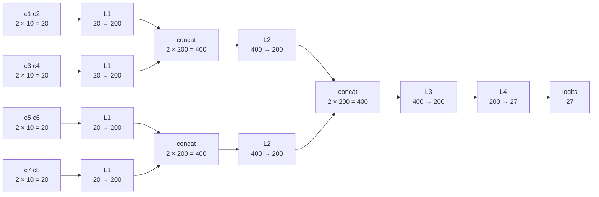

# Le dimensioni, layer per layer

Un allegato a `01_wavenet.py`, non uno script: la stessa rete guardata solo dal
punto di vista delle forme dei tensori, che è il punto in cui questa lezione si
capisce o non si capisce.

La rete qui sotto è la **prima** versione gerarchica della lezione: contesto di
8 caratteri, embedding a 10 dimensioni, 200 canali per livello. È quella che
Karpathy costruisce mentre ispeziona le shape nel notebook, prima di scendere a
68 canali per confrontarla a parità di parametri con la rete piatta. Con 200
canali sono 170897 parametri; l'ultima sezione dà la versione da 68.

## L'albero

Otto caratteri entrano a coppie, e ogni livello dimezza il numero di gruppi.

Le quattro scatole `L1` sono **la stessa matrice**, non quattro matrici
diverse: 20×200 applicata quattro volte, una per bigramma. Idem per le due
`L2`. È esattamente ciò che rende questa architettura una convoluzione
travestita — lo stesso filtro fatto scorrere sulla sequenza — ed è il motivo
per cui nel codice non c'è nessun ciclo: le quattro applicazioni stanno in un
asse del tensore, e `@` le fa in parallelo.

Ogni livello ha un **campo recettivo** che raddoppia: un'attivazione di `L1` ha
visto 2 caratteri, una di `L2` ne ha visti 4, una di `L3` tutti e 8.

## Gli stessi passaggi, come tensori

`N` è il numero di esempi nel batch: 32 durante il training, 8192 nei blocchi
in cui `evaluate()` divide gli split, 1 quando si campiona un nome. Nessun
layer lo sa e nessun peso dipende da lui — è l'asse che si può cambiare senza
toccare niente.

| # | layer | in | out | parametri |
| --- | --- | --- | --- | --- |
| | *input* | | `(N, 8)` interi | |
| 0 | `Embedding(27, 10)` | `(N, 8)` | `(N, 8, 10)` | 270 |
| 1 | `FlattenConsecutive(2)` | `(N, 8, 10)` | `(N, 4, 20)` | — |
| 2 | `Linear(20, 200)` — **W1** | `(N, 4, 20)` | `(N, 4, 200)` | 4000 |
| 3 | `BatchNorm1d(200)` | `(N, 4, 200)` | `(N, 4, 200)` | 400 |
| 4 | `Tanh` | `(N, 4, 200)` | `(N, 4, 200)` | — |
| 5 | `FlattenConsecutive(2)` | `(N, 4, 200)` | `(N, 2, 400)` | — |
| 6 | `Linear(400, 200)` — **W2** | `(N, 2, 400)` | `(N, 2, 200)` | 80000 |
| 7 | `BatchNorm1d(200)` | `(N, 2, 200)` | `(N, 2, 200)` | 400 |
| 8 | `Tanh` | `(N, 2, 200)` | `(N, 2, 200)` | — |
| 9 | `FlattenConsecutive(2)` | `(N, 2, 200)` | `(N, 400)` | — |
| 10 | `Linear(400, 200)` — **W3** | `(N, 400)` | `(N, 200)` | 80000 |
| 11 | `BatchNorm1d(200)` | `(N, 200)` | `(N, 200)` | 400 |
| 12 | `Tanh` | `(N, 200)` | `(N, 200)` | — |
| 13 | `Linear(200, 27)` — **W4** | `(N, 200)` | `(N, 27)` | 5427 |
| | | | | **170897** |

Alla riga 9 l'asse dei gruppi arriva a 1 e `FlattenConsecutive` lo toglie con
uno `squeeze(1)`: da lì in poi il tensore è a due assi e la rete torna a essere
una MLP normale.

## I tre tipi di asse

È la cosa che il disegno tiene insieme e che una lista di shape da sola non
dice. In `(N, 4, 200)` i tre numeri non sono la stessa specie di cosa:

| asse | cos'è | chi lo guarda |
| --- | --- | --- |
| `N` | gli esempi del batch | nessun layer: è solo parallelismo |
| `4` | i gruppi dentro un esempio (i 4 bigrammi) | nessun layer: è **anche questo** parallelismo |
| `200` | i canali, cioè i neuroni | tutti: è l'unico asse che i pesi vedono |

I primi due sono la stessa cosa dal punto di vista dei pesi — posizioni in cui
applicare la stessa matrice — e le due conseguenze pratiche sono le due idee
tecniche della lezione:

1. **`@` moltiplica solo sull'ultimo asse** e tratta tutti quelli davanti come
   batch. `(N, 4, 20) @ (20, 200)` → `(N, 4, 200)`, senza nessun ciclo.
2. **La batchnorm deve mediare su tutti gli assi tranne quello dei canali.**
   Se mediasse solo su `N`, su `(N, 4, 200)` terrebbe 4×200 statistiche invece
   di 200: una per ogni posizione del bigramma, stimata su un quarto dei
   numeri. `nn.BatchNorm1d` fa la cosa giusta, ma vuole i canali *in mezzo*,
   `(N, C, L)` — quindi in `01_wavenet.py` il tensore viene passato come
   `(N·T, C)`, che è la stessa riduzione con i canali dove stanno già.

## Le matrici di pesi

Nessuna delle quattro sa niente di `N` né dei gruppi: sono matrici a due assi, e
i due numeri sono canali in ingresso e canali in uscita.

| | forma | applicata, per ogni esempio | cosa fonde |
| --- | --- | --- | --- |
| **W1** | `(20, 200)` | 4 volte | 2 caratteri → 1 bigramma |
| **W2** | `(400, 200)` | 2 volte | 2 bigrammi → 1 quadrigramma |
| **W3** | `(400, 200)` | 1 volta | 2 quadrigrammi → 1 contesto |
| **W4** | `(200, 27)` | 1 volta | contesto → logits |

Otto applicazioni di matrice per esempio, contro le due della MLP piatta — che
però la prima la fa con una `(80, 200)`, cioè schiaccia tutti e otto i
caratteri in un colpo. È tutta lì la differenza fra le due architetture.

## Dove va a finire l'asse dei gruppi

    8 caratteri  →  4 bigrammi  →  2 quadrigrammi  →  1 contesto
     (N, 8, 10)     (N, 4, 200)     (N, 2, 200)       (N, 200)

Ogni `FlattenConsecutive(2)` dimezza l'asse centrale e raddoppia quello dei
canali: `(N, T, C)` → `(N, T/2, 2C)`. Non calcola niente, è una `view` — i
numeri sono già in quell'ordine in memoria, cambia solo come li si legge. Il
calcolo lo fa il `Linear` subito dopo, che riporta `2C` a `C`.

Tre livelli bastano a consumare 8 caratteri perché 2³ = 8. Con un contesto da
16 ne servirebbero quattro, ed è la figura del paper WaveNet.

## Con 68 canali invece di 200

`01_wavenet.py` usa 68 canali per livello, non 200, perché con 68 i parametri
sono 22397 contro i 22097 della MLP piatta e il confronto diventa onesto. La
struttura non cambia di una riga, cambiano solo i numeri a destra:

    (N, 8)  →  (N, 8, 10)   →  (N, 4, 20)  →  (N, 4, 68)
            →  (N, 2, 136)  →  (N, 2, 68)
            →  (N, 136)     →  (N, 68)     →  (N, 27)

Sono le stesse righe che lo script stampa nella sezione 4.
