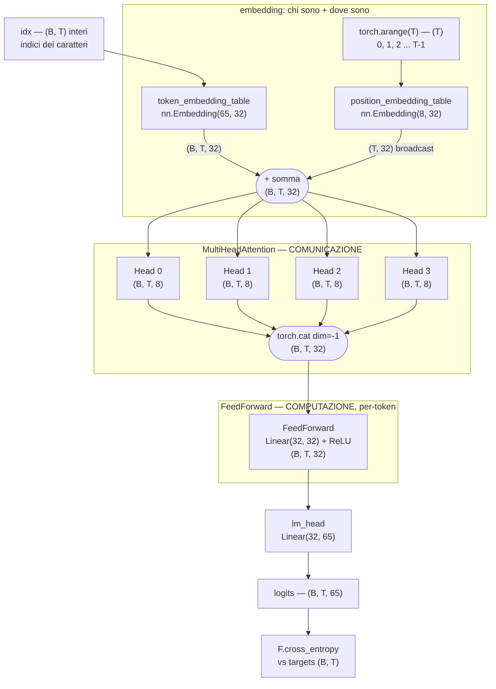
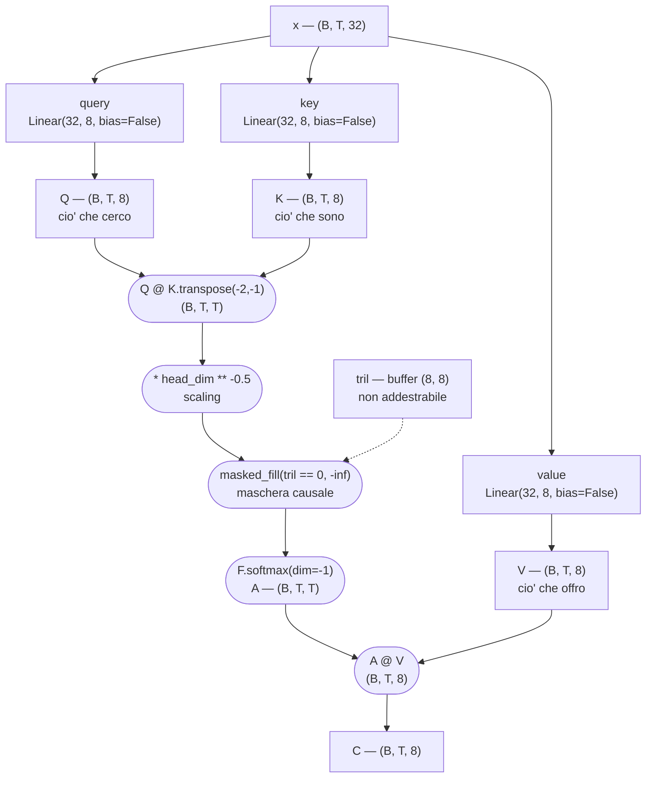
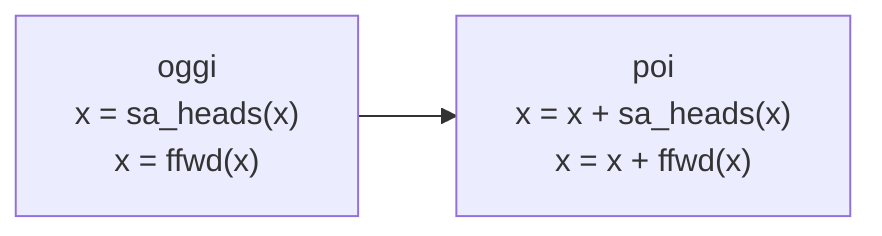

# Schema a blocchi — `03_training.py`, versione a 4 teste

Iperparametri di riferimento: `B = 32` sequenze, `T = 8` posizioni,
`n_embed = 32`, `num_heads = 4`, `head_dim = n_embed // num_heads = 8`,
`vocab_size = 65`.

## Il forward completo

Le quattro teste lavorano **in parallelo** sullo stesso input e ognuna scrive in
una fetta disgiunta dell'uscita: le dimensioni 0-7 vengono solo dalla testa 0,
le 8-15 solo dalla testa 1, e così via. Sono spazi `V` diversi e indipendenti,
non le dimensioni dell'embedding di partenza.

## Dentro una singola `Head`

`A` è la matrice dei pesi: la riga `t` dice quanto la posizione `t` pesa ognuna
delle posizioni `0..t`. Il triangolo superiore è a `-inf` **prima** della
softmax, cioè peso zero **dopo**: nessuno guarda il futuro.

## Parametri (versione a 4 teste)

| blocco | parametri |
| --- | ---: |
| `token_embedding_table` (65 × 32) | 2 080 |
| `position_embedding_table` (8 × 32) | 256 |
| `sa_heads` — 4 teste × 3 proiezioni × (32 × 8) | 3 072 |
| `ffwd` — Linear(32, 32) + bias | 1 056 |
| `lm_head` — Linear(32, 65) + bias | 2 145 |
| **totale** | **8 609** |

La versione a 1 testa ha esattamente gli stessi 8 609 parametri: cambia solo
come sono spartiti, 1 × (32 → 32) invece di 4 × (32 → 8). Val loss 2.3509
contro 2.2495.

## Cosa NON c'è ancora

- **il flusso residuo**: qui ogni stadio *sostituisce* `x` invece di aggiungergli
  un delta. Dopo l'attention, `tok_emb + pos_emb` non esiste più.
- **la proiezione finale** dentro `MultiHeadAttention` (`proj`), che riporterebbe
  la concatenazione nello spazio degli embedding prima di sommarla al residuo.
- **il fattore 4** nel feed-forward: nel paper è `Linear(32, 128) + ReLU + Linear(128, 32)`.
- **il `Block`** ripetuto in profondità, e i **LayerNorm**.
