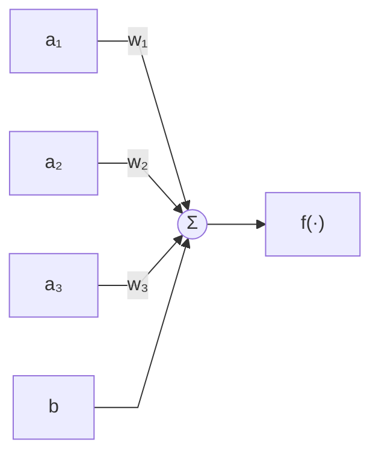
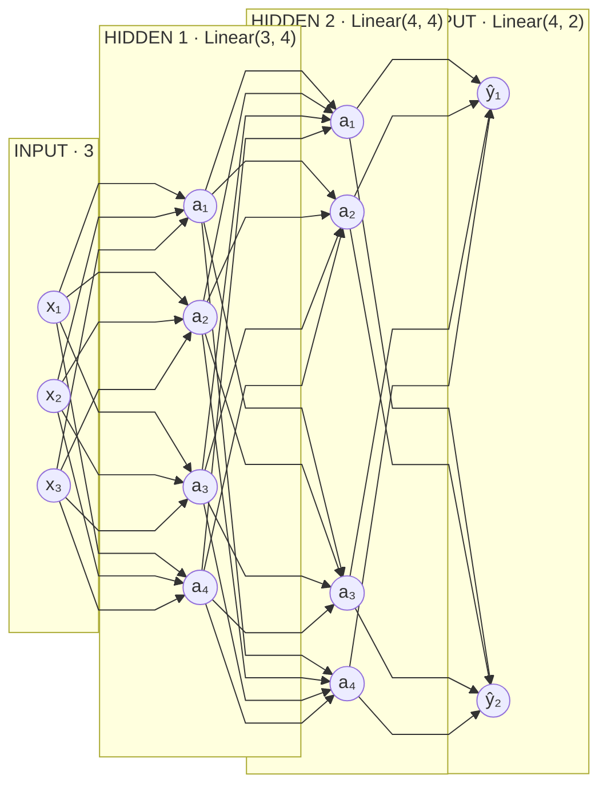
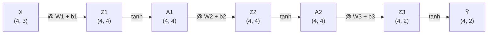

# Appunti: MLP, backpropagation, gradient descent

## L'MLP

Un MLP si definisce impilando dei `nn.Linear`, uno per layer, con in mezzo una
funzione di attivazione:

```python
mlp = nn.Sequential(
    nn.Linear(3, 4),
    nn.Tanh(),
    nn.Linear(4, 4),
    nn.Tanh(),
    nn.Linear(4, 2),
    nn.Tanh(),
)
```

`nn.Linear(nin, nout)` e' **un layer di `nout` neuroni, ognuno con `nin`
input**. I due numeri sono la forma del layer, e devono incastrarsi: l'output di
uno e' l'input del successivo. Quindi `Linear(3, 4)` legge i 3 input e produce 4
attivazioni, il `Linear(4, 4)` dopo ne legge 4 e ne produce 4, l'ultimo ne legge
4 e produce i 2 output della rete.

Il primo numero del primo Linear e' quanti input ha la rete, il secondo numero
dell'ultimo e' quanti output tira fuori. Tutti i numeri in mezzo sono scelte
libere: quanti neuroni mettere, e quindi quanto e' grossa la rete.

### Un neurone

Dentro un `nn.Linear` non c'e' niente di magico: c'e' un neurone per ogni
output. Ogni neurone prende le attivazioni del layer precedente, le pesa, ci
somma un bias, e passa il risultato nella funzione di attivazione. Qui uno dei
quattro neuroni di `nn.Linear(3, 4)`:



I `wᵢ` e il `b` sono i parametri del neurone: quelli che il training cambia.
Gli `aᵢ` in ingresso arrivano da fuori.

`nn.Linear` li tiene tutti insieme, i pesi in una matrice `(nin, nout)` e i bias
in un vettore da `nout`, e li inizializza da solo con dei numeri a caso. Quindi
`Linear(3, 4)` sono `4*3 + 4` = 16 parametri, e la rete qua sopra ne ha 46 in
tutto (`mlp.parameters()` li elenca, `sum(p.numel() for p in mlp.parameters())`
li conta).

`f()` e' la funzione di attivazione, ad esempio `tanh` / `relu` / `sigmoid`: nel
codice e' il `nn.Tanh()` fra un Linear e l'altro, ed e' quello che rende la rete
non lineare. Senza, tre Linear di fila collasserebbero in un Linear solo, e
tutta la rete saprebbe fare solo una moltiplicazione fra matrici.

### La rete

Ogni layer e' collegato completamente al precedente: ogni neurone riceve **tutte**
le attivazioni di quello prima. Ecco perche' i pesi di un Linear sono una
matrice, e perche' i numeri devono incastrarsi. La rete qua sopra, disegnata:



## Un MLP e' una grande espressione

Fondamentalmente un MLP e' un'enorme espressione con:

- **input**
- **parametri** (i `w` e i `b`)

che tira fuori un certo numero di **output**.

E l'espressione si scrive tutta su una riga. Se `X` e' la matrice degli input,
una riga per esempio, la rete di prima e':

```
Ŷ = tanh( tanh( tanh(X @ W1 + b1) @ W2 + b2 ) @ W3 + b3 )
```

`@` e' il prodotto fra matrici, e ogni `nn.Linear` e' esattamente un `@ W + b`:
la matrice dei pesi e il vettore dei bias del layer.

### Un layer, disegnato

Un `nn.Linear(3, 4)` applicato a 4 esempi in un colpo solo:

```
     X · (4, 3)           W1 · (3, 4)          b1 · (4,)          Z1 · (4, 4)

┌   2.0  3.0 -1.0 ┐                         ┌ b₁ b₂ b₃ b₄ ┐   ┌ z₁₁ z₁₂ z₁₃ z₁₄ ┐
│   3.0 -1.0  0.5 │   ┌ w₁₁ w₁₂ w₁₃ w₁₄ ┐   │ b₁ b₂ b₃ b₄ │   │ z₂₁ z₂₂ z₂₃ z₂₄ │
│   0.5  1.0  1.0 │ @ │ w₂₁ w₂₂ w₂₃ w₂₄ │ + │ b₁ b₂ b₃ b₄ │ = │ z₃₁ z₃₂ z₃₃ z₃₄ │
└   1.0  1.0 -1.0 ┘   └ w₃₁ w₃₂ w₃₃ w₃₄ ┘   └ b₁ b₂ b₃ b₄ ┘   └ z₄₁ z₄₂ z₄₃ z₄₄ ┘

                        A1 = tanh(Z1), elemento per elemento, sempre (4, 4)
```

Come si legge:

- **una riga di `X`** = un esempio, **una colonna di `W1`** = un neurone.
- la casella `zᵢⱼ` e' il prodotto scalare fra la riga `i` e la colonna `j`:
  cioe' la somma dei `w*x` del neurone `j` sull'esempio `i`, quella del disegno
  del neurone la' sopra. Tutte le caselle insieme sono tutti i neuroni valutati
  su tutti gli esempi.
- `b1` e' un vettore da 4, uno per neurone, e va sommato **a ogni riga**: e'
  disegnato ripetuto 4 volte perche' e' quello che fa il broadcasting, senza
  copiarlo davvero.
- `tanh` non cambia forma: schiaccia ogni casella per conto suo.

### La rete intera, come catena di forme



La prima dimensione (4, il numero di esempi) non cambia mai: attraversa la rete
intatta. La seconda e' quella che i Linear rimodellano, 3 → 4 → 4 → 2.

**Le righe non si parlano.** In tutta la catena non c'e' nessuna operazione che
mescoli due righe: la riga `i` dell'output dipende solo dalla riga `i` di `X`.
Passare 4 esempi insieme o uno alla volta da' gli stessi identici numeri, e' solo
che una moltiplicazione fra matrici e' molto piu' veloce di quattro giri di
Python. Il primo punto in cui gli esempi si incontrano e' il **loss**, che li
somma tutti in un unico numero.

## Training

I dati:

- `inputs` = matrice `(N, I)`
- `outputs` = matrice `(N, O)`

dove `N` = numero di esempi.

### Loss

Il loss e' una misura dell'errore della predizione che fa la rete rispetto
all'effettivo output. E' fondamentale per capire se cambiare i parametri
migliora o peggiora il risultato:

```
# forward pass, calcolo il vettore di output
per ogni esempio:
  y[nth_esempio] = mlp(inputs[nth_esempio])

# calcolo del loss
loss = 0
per ogni esempio:
  loss += (expected_output[nth_esempio] - y[nth_esempio])^2
```

Ci sono tante formule diverse per il loss: mean squared (Pitagora),
max-margin...

### La struttura dati

Ma come fare a capire COME modificare i parametri?

Immaginiamo di NON usare scalari semplici, ma strutture dati particolari, che
wrappano lo scalare e si portano dietro anche informazioni aggiuntive. Queste
strutture reagiscono a tutti gli operatori numerici in maniera trasparente,
quindi non ce ne accorgiamo nemmeno:

```
# scalare
x1 = 2.0

# wrapper
x1 = Value(2.0, label="x1")
x1.data    # => 2.0

x2 = Value(3.0, label="x2")

x3 = x1 + x2
x3.data    # => x3 e' anch'esso un Value
x3._prev   # => gli oggetti x1 e x2 (i "children")
```

Tutti i calcoli del codice qua sopra (moltiplicazioni/somme/etc. di input e pesi
di tutto l'MLP, fino a calcolare il loss) ovviamente potremmo tranquillamente
rifarli con queste strutture dati.

```
loss = .... # questa volta loss e' un Value
```

### Cos'e' il gradiente

Grazie al fatto di avere i collegamenti ad albero tra tutte le operazioni tra
tutte le variabili, siamo in grado di calcolare il GRADIENTE rispetto al dato
finale, il loss.

```
loss = .... # questa volta loss e' un Value

# una volta calcolato, lanciamo la "ricorsione"
loss.backward()

# ..e tutti i Value della catena avranno .grad calcolato secondo loss
w1.grad # => 0.123423
```

Si calcola sempre rispetto a qualcosa, ed e' la direzione che, localmente, 
e' da prendere per massimizzare quel dato finale sul quale e' stato
calcolato.

In pratica, e' un numero che, moltiplicato per un piccolissimo delta, possiamo
aggiungere alla variabile stessa, con la certezza che il risultato finale
(il loss) sara' sicuramente maggiore.

Il gradiente tiene conto di tutte le (magari centinaia di) dipendenze e utilizzi
di una variabile. Il contributo di gradiente di ogni utilizzo di una variabile si 
somma al gradiente gia' calcolato per le altre occorrenze.

Per cui e' un'informazione diretta: "all'aumentare del valore di questa variabile, 
considerati TUTTI gli utilizzi del valore in tutte le operazioni della catena, 
l'output finale in fondo alla giga espressione, sicuramente aumentera'".

- piu' e' alto un gradiente, piu' aumentera' forte
- se un gradiente e' negativo, vuol dire che aumentare il valore fara'
  **scendere** l'output finale

### Il loop di training

Adesso ci sono tutti i pezzi: si tratta di ripeterli.

```
per ie. 100 volte:
  # forward pass, calcolo il loss
  # zero grad (azzero i grad calcolati al giro precedente) + .backward() nuovo

  # update
  per ogni parametro dell'MLP (mlp.parameters()):
    parametro.value += -0.1 * parametro.grad
```

**Perche' `0.1`, cioe' piccolo?** Perche' i gradienti sono estremamente locali:
se ti sposti di troppo, smettono di descrivere l'andamento reale.

**Perche' `-0.1` negativo?** Perche' vogliamo portare a zero il loss, non farlo
crescere: dobbiamo andare nella direzione inversa del gradiente. Questa tecnica 
di training viene infatti anche detta **gradient descent**: seguiamo passo passo
il gradiente, al contrario.

I gradienti sono tutto sommato semplici da calcolare, e si basano su concetti di
derivata estremamente semplici:
<https://www.youtube.com/watch?v=VMj-3S1tku0&list=PLAqhIrjkxbuWI23v9cThsA9GvCAUhRvKZ>