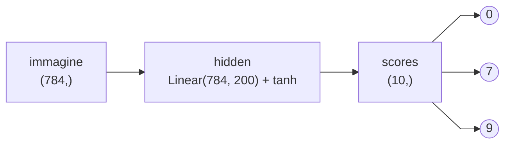

# Appunti: classificare con una rete neurale

## Il problema cambia: da "quanto" a "quale"

Nella tappa precedente la rete aveva **un** neurone d'uscita e doveva
indovinare un numero. E' una **regressione**: l'output vive sulla retta dei
reali, e la cosa sensata da misurare e' di quanto la rete ha sbagliato. Da qui
`MSELoss`, la media dei quadrati degli scarti.

Adesso l'input e' un'immagine 28x28 di MNIST e l'output e' una cifra fra 0 e 9.
Sembra ancora "indovina un numero", ma non lo e': e' una **classificazione**,
una scelta fra 10 possibilita'. E lo si vede subito provando a riusare l'MSE:

- scambiare un `7` per un `1` darebbe errore 6, scambiarlo per un `8` darebbe
  errore 1. Ma le cifre non sono piu' o meno vicine fra loro: sono 10 etichette
  diverse, e sbagliare e' sbagliare.
- una predizione tipo `6.4` non vuol dire niente. Non esiste la cifra 6.4.

Le classi non hanno un ordine, quindi non possono stare su un asse solo.
Servono 10 assi.

## 1. Un neurone per classe

La regola e': **l'ultimo layer ha tanti neuroni quante sono le classi**.

```python
nn.Linear(HIDDEN, 10)   # 10 classi -> 10 neuroni d'uscita
```

Ogni neurone d'uscita ha un lavoro solo, e sempre lo stesso: dire quanto crede
alla *sua* classe. Il neurone 7 non sa niente delle altre cifre, guarda le
attivazioni del layer sotto e risponde "quanto sembra un 7". L'uscita della
rete non e' piu' un numero per esempio, e' un **vettore da 10 numeri** per
esempio: la forma passa da `(N, 1)` a `(N, 10)`.



### Cosa sono quei 10 numeri

Il modo utile di leggerli e' pensarli come **predizioni di conteggi**, cioe'
predizioni di frequenze: "su tante immagini fatte cosi', quante volte e' venuto
fuori uno 0, quante volte un 1, ...".

Perche' i conteggi sono comodi? Perche' da un conteggio si va a una probabilita'
con una divisione:

```
counts = [ 3, 0, 1, 0, 0, 0, 0, 42, 0, 2 ]
probs  = counts / counts.sum()          # -> [0.06, 0, 0.02, ..., 0.88, 0, 0.04]
```

E le probabilita' sono quello che serve davvero: sono l'unica forma in cui
"quanto la rete ci crede" e' confrontabile fra classi, fra esempi e fra modelli
diversi.

C'e' pero' un problema.

## 2. Dai conteggi ai logits

Un neurone calcola `w·x + b`. Il suo range naturale e' **(-inf, +inf)**: pesi e
input sono numeri qualsiasi, la somma e' un numero qualsiasi. Non c'e' nessun
motivo per cui dovrebbe venire fuori un conteggio, cioe' un numero positivo.

La soluzione e' girare il problema al contrario. Invece di costringere il
neurone a produrre un conteggio, **si lascia il neurone libero** e si cambia
l'interpretazione: quello che esce non e' il conteggio, e' il **logaritmo** del
conteggio.

Da qui il nome: **logit** = log-count. E' solo un nome per "l'uscita grezza
dell'ultimo layer, prima di qualsiasi normalizzazione".

### Ripasso: com'e' fatto il logaritmo

`log(x)` risponde a una domanda sola: **a che esponente devo elevare `e` per
ottenere `x`?** Ed `exp` e' la stessa domanda al contrario, quindi le due
funzioni sono l'una l'inversa dell'altra: `log(exp(z)) = z` e `exp(log(x)) = x`.
Sul grafico questo si vede come una simmetria rispetto alla diagonale `y = x`,
le due curve sono la stessa curva riflessa:

```
  6                     |          #                        ..
                        |         ## exp(x)         y = x....
                        |         #                    ...
                        |        ##                 ....
                        |        #                ...
  4                     |       ##             ....
                        |      ##           ....
                        |     ##          ...
                        |    ##        ....
                        |   ##       ...            log(x)
  2                     |  ##     ....                    oooo
                        |###    ...           ooooooooooooo
                       ###   ....      oooooooo
                   #####|  ...    oooooo
       #############    ....  ooooo
  0  ###--------------...---ooo-------------------------------
                   .... |  oo
                ....    | oo
              ...       |oo
           ....         |o
 -2      ...            oo
      ....              o
     ..                 o
           -2           0           2            4           6
```

Quello che conta qui sono i **domini**, e sono l'esatto scambio l'uno
dell'altro:

|          | prende                | restituisce    |
| -------- | --------------------- | -------------- |
| `log(x)` | `x` in `(0, +inf)`    | `(-inf, +inf)` |
| `exp(z)` | `z` in `(-inf, +inf)` | `(0, +inf)`    |

E in più, log/exp hanno questa proprietà interessante:

```
log(a * b) = log(a) + log(b)
exp(z + c) = exp(z) * exp(c)
```

### Tornando ai logit

Se per noi l'output della rete e' log(count), qualsiasi numero positivo/negativo
e' un count valido:

```
logit  -2.0   ->  count 0.1353    un conteggio piccolo, ma mai zero
logit   0.0   ->  count 1.0       il logit "neutro"
logit  +1.0   ->  count 2.7183    cioe' e
logit  +3.2   ->  count 24.5325
```

## 3. Softmax

`exp` + normalizzazione a probabilità, i due passi insieme, sono la **softmax**:

```python
probs = F.softmax(logits, dim=1)
```

`dim=1` e' la dimensione delle classi: si normalizza **riga per riga**, ogni
esempio ha la sua distribuzione, e gli esempi non si parlano (come tutto il
resto della rete: vedi `02.md`).

Un giro completo su un esempio, con numeri veri:

```
logits   -1.20   0.30   2.50  -0.40   0.90  -2.00   1.10   3.20  -0.70   0.10

faccio l'exp

counts    0.30   1.35  12.18   0.67   2.46   0.14   3.00  24.53   0.50   1.11
                                                                  sum = 46.24

divido per / 46.24

probs    0.007  0.029  0.264  0.014  0.053  0.003  0.065  0.531  0.011  0.024
                                                                  sum = 1.000
```

Riassumendo i range:

| passo    | operazione                | range              | forma     |
| -------- | ------------------------- | ------------------ | --------- |
| `logits` | `hidden @ W + b`          | `(-inf, +inf)`     | `(N, 10)` |
| `counts` | `logits.exp()`            | `(0, +inf)`        | `(N, 10)` |
| `probs`  | `counts / counts.sum(1)`  | `(0, 1)`, riga = 1 | `(N, 10)` |

## 4. Il loss: negative log likelihood

Adesso abbiamo una probabilita' per ogni classe. Cosa si misura il loss?

**Leggiamo SOLO la probabilita' che la rete ha dato alla classe giusta.** Le
altre nove non si guardano nemmeno.

Un esempio del dataset e' una coppia. Numerandoli da `0` a `n-1`:

```
xᵢ   l'immagine dell'esempio i           784 numeri
yᵢ   la sua classe vera                  un intero da 0 a 9
```

e la scrittura che serve e':

```
p(yᵢ | xᵢ)     "la probabilita' che il modello assegna alla classe yᵢ,
                avendo visto l'immagine xᵢ"
```

`p(yᵢ | xᵢ)` e' semplicemente **una casella della tabella `probs`**.

```
p(yᵢ | xᵢ)   e'   probs[i, y[i]]
```

### Una casella per riga

Concretamente, con `n = 4` esempi e un modello a meta' allenamento (fra
parentesi quadre la casella pescata, cioe' la classe vera):

```
classe:          0      1      2      3      4      5      6      7      8      9       yᵢ    p(yᵢ|xᵢ)

esempio 0     .006   .010   .003   .007   .014   .005   .045  [.901]  .006   .004        7      0.901  <- qui la rete ci sta prendendo
esempio 1     .049   .028  [.555]  .047   .073   .060   .050   .112   .020   .005        2      0.555
esempio 2     .025   .013   .006   .008   .002   .024   .008   .006   .001  [.908]       9      0.908  <- qui la rete ci sta prendendo
esempio 3    [.294]  .033   .147   .055   .020   .152   .178   .049   .040   .033        0      0.294  <- qui la rete e' ancora incerta
```

Ogni riga somma a 1 (e' la softmax), ma di ogni riga ne usiamo **una casella
sola**: quella che `yᵢ` indica. Le altre 36 non entrano mai nel conto, e non
serve che ci entrino.

### Dal prodotto al loss

La **likelihood** e' la probabilita' che il modello assegna all'**intero
dataset**: tutte le probabilità delle caselle pescate, moltiplicate fra loro. E'
quello che vogliamo massimizzare.

```
likelihood = p(y₀ | x₀) · p(y₁ | x₁) · ... · p(yₙ₋₁ | xₙ₋₁)

           = 0.901 · 0.555 · 0.908 · 0.294  =  0.1333
```

Gia' con 4 esempi siamo a `0.13`. Con 60.000 esempi e' un prodotto di 60.000
numeri minori di 1: va in **underflow**, diventa esattamente `0.0`, e da uno
zero non si ricava nessun gradiente.

Serve il **logaritmo**, che trasforma il prodotto in una somma (il `log(a·b) =
log(a) + log(b)` del ripasso) senza spostare il punto di massimo:

```
log_likelihood = log p(y₀|x₀) + log p(y₁|x₁) + ... + log p(yₙ₋₁|xₙ₋₁)

               = -0.105 + -0.589 + -0.096 + -1.225  =  -2.015
```

È lo stesso numero di prima: `log(0.1333) = -2.015`. Non abbiamo cambiato
quantita', solo il modo di scriverla.

Ogni addendo e' `<= 0`, perche' le probabilita' stanno in `(0, 1]` e li' il log
e' negativo. Quindi la log likelihood sta in `(-inf, 0]`, e il massimo, `0`, e'
il modello perfetto. E' quasi un loss: basta girargli il segno, cosi' `0`
diventa il minimo invece del massimo, e dividere per `n`, cosi' il valore non
dipende da quanto e' grande il dataset:

```
loss = - ( log p(y₀|x₀) + ... + log p(yₙ₋₁|xₙ₋₁) ) / n

     = 2.0149 / 4  =  0.5037
```

Questa e' la **negative log likelihood media**. Il range e' `[0, +inf)`.

Da notare, nei numeri qua sopra: l'esempio 3 — l'unico su cui la rete e'
incerta, `p = 0.294` — da solo vale `1.225` dei `2.015` totali, piu' della meta'
del loss, mentre i due esempi facili messi insieme valgono `0.2`. **Il loss e'
dominato dagli esempi su cui la rete va male**, ed e' esattamente quello che
serve: e' li' che c'e' qualcosa da imparare.

### In codice

Sono due righe, e la seconda e' l'indicizzazione che si vede dappertutto:

```python
probs = F.softmax(logits, dim=1)          # (n, 10)
loss  = -probs.log()[range(n), y].mean()  # una casella per riga
```

`[range(n), y]` e' proprio la tabella qua sopra: pesca la casella `(0, y[0])`,
poi `(1, y[1])`, poi `(2, y[2])`, e cosi' via. `n` numeri, uno per esempio, di
cui si fa la media. Il one-hot non compare mai — indicizzare e' la stessa cosa,
e costa molto meno.

Qualche valore di riferimento per sapere quando un numero e' buono:

```
loss 0        il modello perfetto: probabilita' 1.0 sulla classe giusta,
              sempre. Limite teorico.
loss 2.3026   -log(1/10), il modello che tira a caso fra 10 classi.
              E' anche la loss che ci si aspetta al passo 0, con i pesi
              inizializzati a caso: se e' molto piu' alta, qualcosa non va.
loss 0.5037   la tabella a 4 esempi qua sopra.
loss 0.6338   la riga di softmax del paragrafo 3, se la classe vera e' la
              7 (p = 0.531): la rete ci ha preso, ma senza strafare.
loss 5.8338   la stessa riga, se invece la classe vera e' la 5 (p = 0.003):
              il loss e' grande quando la rete e' sicura *e* sbagliata.
```

## 5. Softmax + log + media = cross entropy

I tre passi — softmax, log della classe giusta, media — sono cosi' sempre
insieme che PyTorch li fa in una chiamata sola, la **cross entropy**:

```python
loss = F.cross_entropy(logits, y)
```

## Quello che si vede in `06.py`

```python
model = nn.Sequential(
    nn.Linear(784, HIDDEN),
    nn.Tanh(),
    nn.Linear(HIDDEN, 10),   # <- 10 neuroni, e nessuna attivazione dopo
)

F.cross_entropy(model(xb), yb).backward()
```

**Non c'e' `nn.Tanh()` dopo l'ultimo Linear**, e non e' una dimenticanza: in
`03.py` e `04.py` c'era, qui sarebbe un bug. La `tanh` schiaccia i logits in
`(-1, +1)`, quindi i conteggi in `(0.37, 2.72)`, quindi il rapporto massimo fra
due conteggi della stessa riga sarebbe `e^2 = 7.39`.